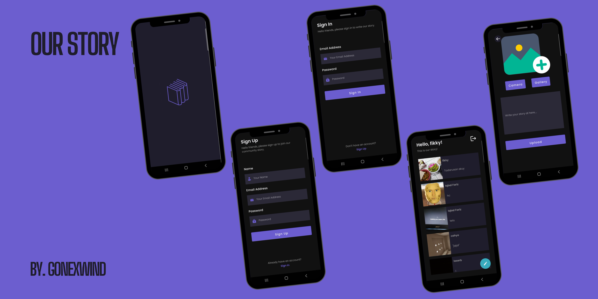
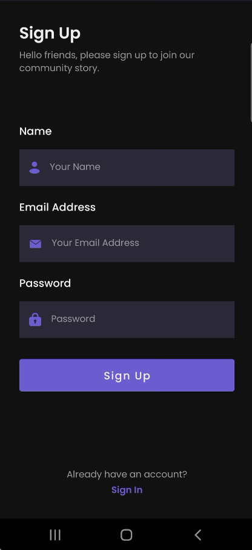

# **Our Story**

**Our Story** is an app to share your stories

# Application Install

***You can Install and test latest Our Story app from below 👇***

## Setup
Clone the repository on your machine. Open the project on your IDE and connect it to firebase and harperDB and everything will be setup

## About
It uses retrofit.
- Fully functional.
- Clean and Simple Material UI.
- It's dark theme 🌗.

## MAD Score

Full details of MAD Score:- [MAD Score](https://madscorecard.withgoogle.com/scorecards/2544709019/)

## 📸 Screenshots
||||
|:----------------------------------------:|:-----------------------------------------:|:-----------------------------------------: |
|  |  |  |
|   |  |

## Built With 🛠
- [Kotlin](https://kotlinlang.org/) - First class and official programming language for Android development.
- [Coroutines](https://kotlinlang.org/docs/reference/coroutines-overview.html) - For asynchronous and more..
- [Flow](https://kotlin.github.io/kotlinx.coroutines/kotlinx-coroutines-core/kotlinx.coroutines.flow/-flow/) - A cold asynchronous data stream that sequentially emits values and completes normally or with an exception.
- [Android Architecture Components](https://developer.android.com/topic/libraries/architecture) - Collection of libraries that help you design robust, testable, and maintainable apps.
    - [ViewModel](https://developer.android.com/topic/libraries/architecture/viewmodel) - Stores UI-related data that isn't destroyed on UI changes.
    - [ViewBinding](https://developer.android.com/topic/libraries/view-binding) - Generates a binding class for each XML layout file present in that module and allows you to more easily write code that interacts with views.
    - [SharedPreferences](https://developer.android.com/reference/android/content/SharedPreferences) - Reading and writing key-value pairs.
- [Dependency Injection](https://developer.android.com/training/dependency-injection) -
    - [Hilt-Dagger](https://dagger.dev/hilt/) - Standard library to incorporate Dagger dependency injection into an Android application.
    - [Hilt-ViewModel](https://developer.android.com/training/dependency-injection/hilt-jetpack) - DI for injecting `ViewModel`.
- [Retrofit](https://square.github.io/retrofit/) - A type-safe HTTP client for Android and Java.
- [GSON](https://github.com/google/gson) - A modern JSON library for Kotlin and Java.
- [GSON Converter](https://github.com/square/retrofit/tree/master/retrofit-converters/gson) - A Converter which uses GSON for serialization to and from JSON.
- [Coil](https://github.com/coil-kt/coil) - An image loading library for Android backed by Kotlin Coroutines.
- [Material Components for Android](https://github.com/material-components/material-components-android) - Modular and customizable Material Design UI components for Android.

# Package Structure

    com.gonexwind.ourstory         # Root Package
    .
    ├── core                    # Core of the app
    |   ├── di                  # Dependency Injection  
    |   ├── repository          # Single source of data
    │   └── source              # Source of data
    |       ├── datasrouce      # Datasource classes
    |       ├── model           # Model data classes, both remote and local entities
    |       └── remote          # Remote classes
    |           ├── network     # Network classes
    |           ├── request     # Request classes
    |           └── response    # Response classes
    |
    ├── ui                      # UI/View layer
    │   └── auth                # Authorization Fragments and ViewModel
    |        ├── customview     # Custom view for password edit text
    |        ├── signin         # Sign In fragments
    |        └── signup         # Sign Up fragments
    │   ├── splashscreen        # Splash Screen fragments
    │   └── story               # Story Fragments and ViewModel
    |       ├── add             # Add Story fragments
    |       ├── detail          # Detail Story fragments
    |       └── list            # List Story fragments
    └── utils                   # Utility Classes / Kotlin extensions

## Architecture
This app uses [***MVVM (Model View View-Model)***](https://developer.android.com/jetpack/docs/guide#recommended-app-arch) architecture.

## Contact
If you need any help, you can connect with me.

Visit:- [gonexwind git's](https://github.com/gonexwind)
  

